# 1、flag{21,3389,8080}

FTP协议默认使用21端口（控制通道-命令交互）和20端口（数据通道--文件传输），明文传输。

查看桌面流量包发现存在大量FTP流量，且存在登录请求，初步怀疑是ftp爆破。

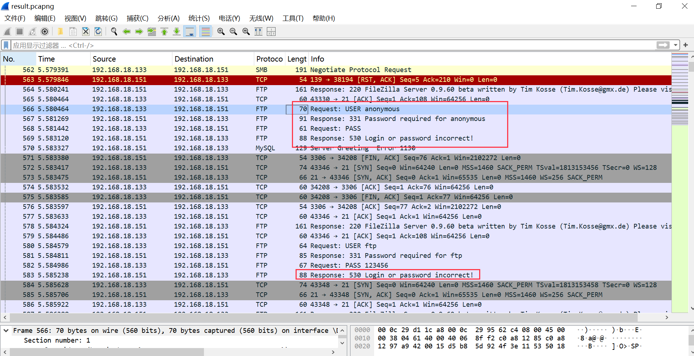

筛选ftp流量,确实存在ftp爆破行为。

```
tcp.port == 21
```

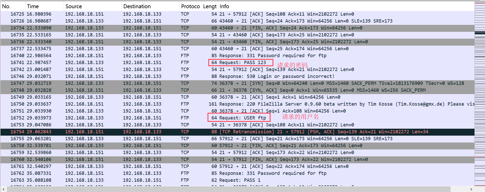

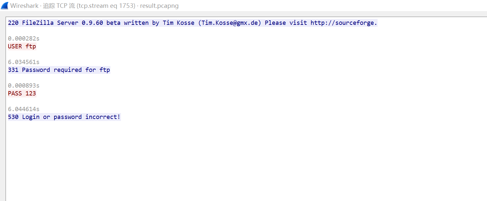

FTP登录成功的响应代码为230，筛选是否有ftp爆破成功的流量，攻击者成功通过 admin/password 登录。

```
ftp.response.code == 230
```

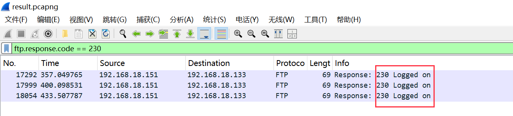

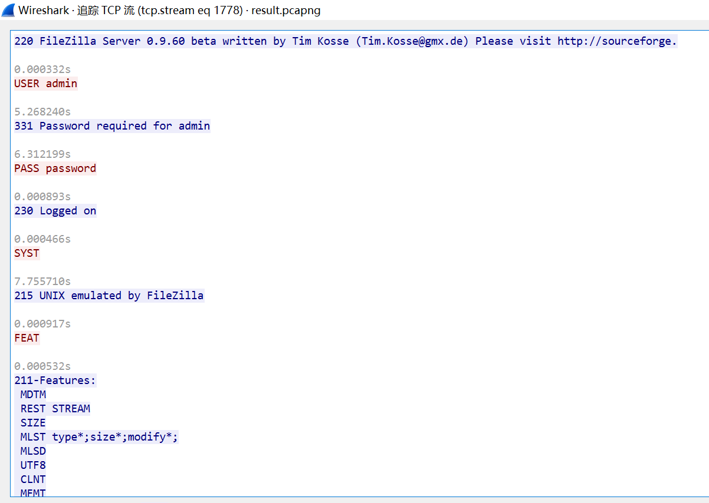

发现大量get和post请求，其中请求头包含目录遍历访问，sql注入

```
tcp.port == 8080 || udp.port == 8080
```

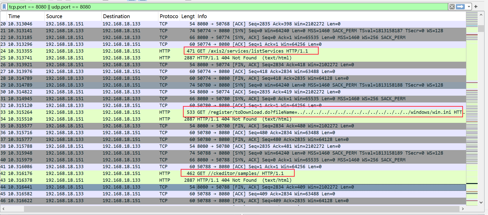

筛选成功的流量，发现存在 DedeCMS 的远程代码执行攻击，8080端口爆破成功。

```
tcp.port == 8080 && http.response.code == 200
```

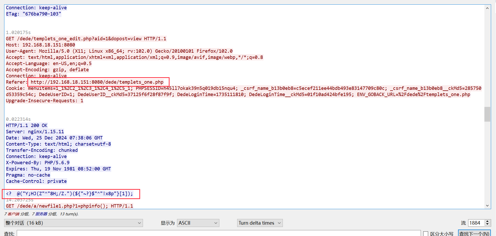

筛选3389端口流量，发现有大量tcp rst（失败）流量，然后又出现client hello 和 Server hello，可能是爆破成功。短连接后变长连接，爆破成功。

> 爆破阶段：大量短连接( SYN -->  RST )
>
> 成功阶段：长连接 + SSL App Data

```
tcp.port == 3389 && ssl.app_data
```

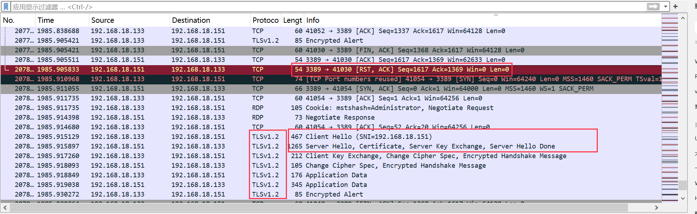

# 2、flag{newfile1.php}

查看临时文件，最近访问的文件，在最近访问的文件中发现可疑文件（该文内容不符合php格式文件）


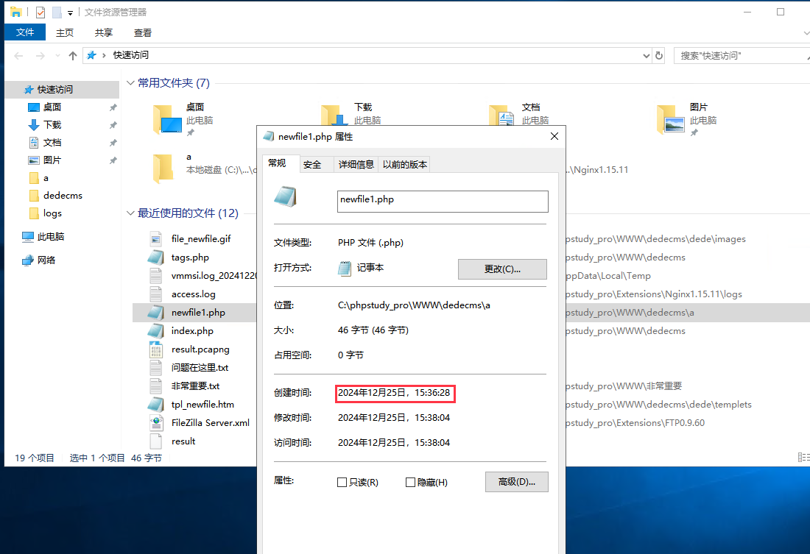

查看日志，发现该文件是192.168.18.133（被攻陷ip）上传的

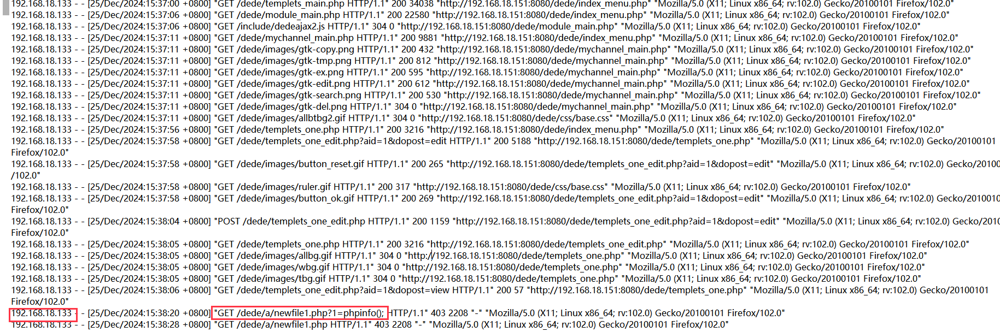

# 3、flag{3389}

netstat -ano 查看网络连接情况，3389端口连接成功，且之前有爆破成功的流量特征。

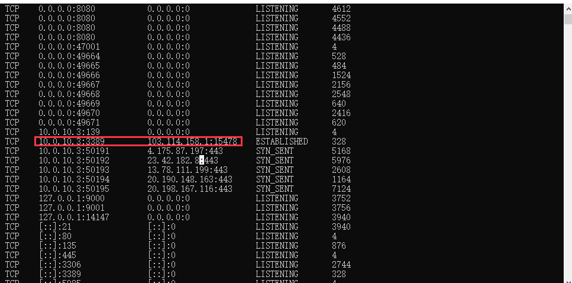

# 4、flag{192.168.18.133}

192.168.18.133这个IP出现目录遍历，文件上传，sql注入等攻击行为，确认为失陷ip

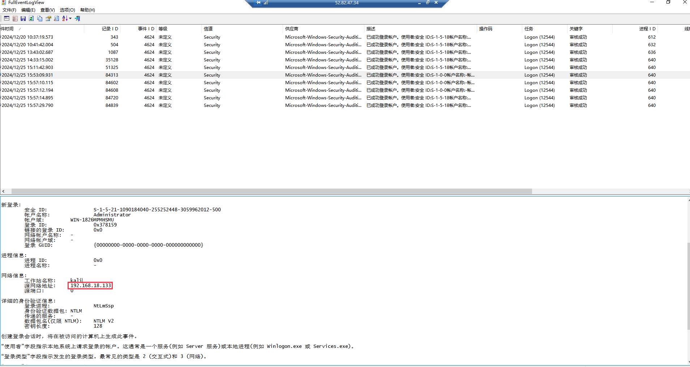

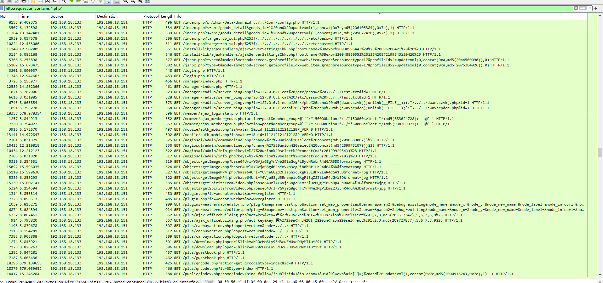

# 5、flag{192.168.18.1}

分析最后的流量，发现有大量对192.168.18.1的攻击流量，日志分析该ip登录成功过，确认为最后失陷的ip

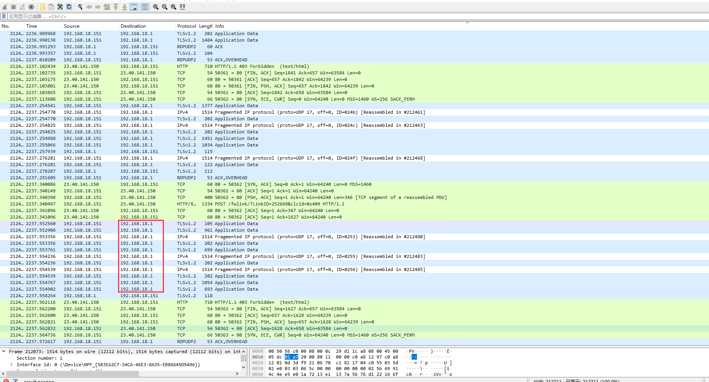

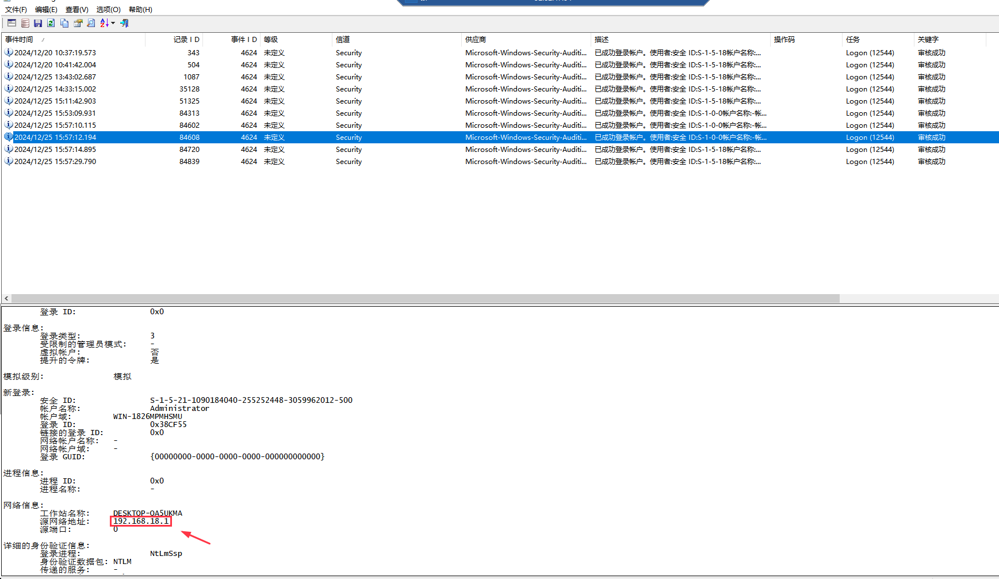

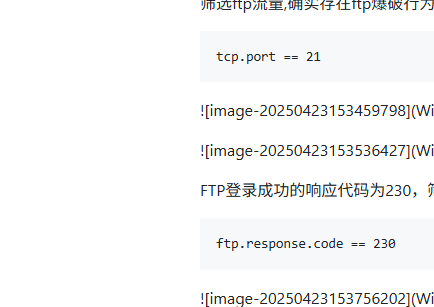